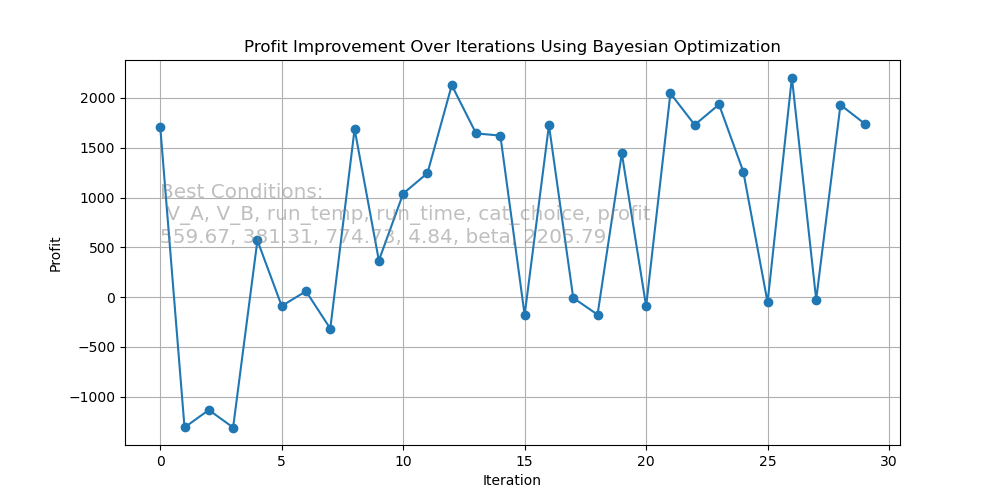
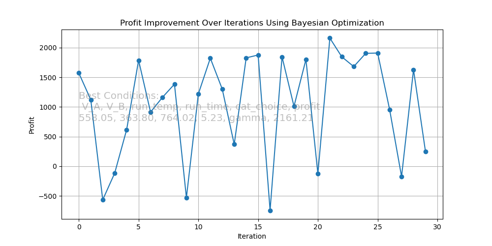
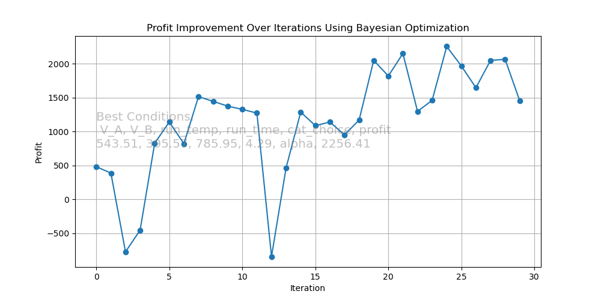
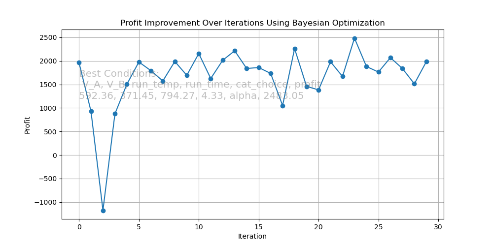
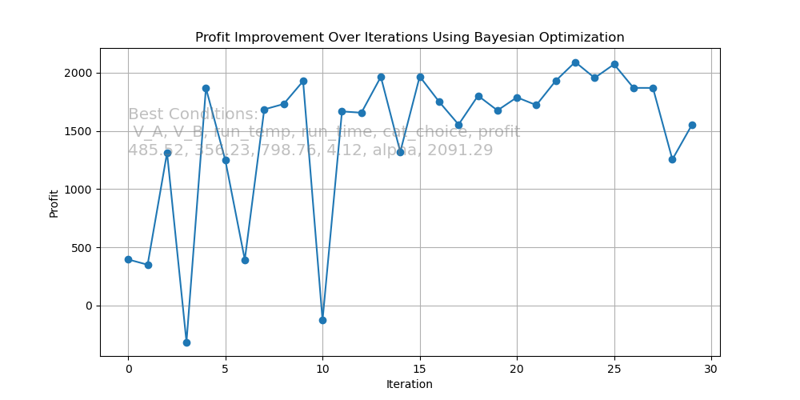
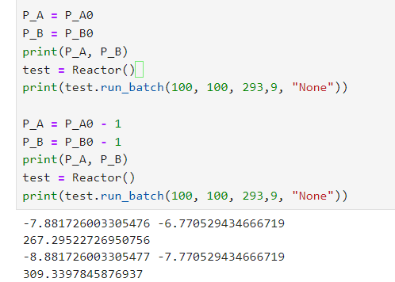

# Report
### Methods:
Suppose that since we need A and B for the reaction, the mechandizer of A and B both suggest they can give us some discount. mechandizer of B says they might give us more discount to make us use more B in our reactions. Therefore, when I buy more product, the price will be cheaper. 

Suppose the prize is listed as follows:

$$self.P_A = P_A * (1 - 0.5*V_A/V)$$
$$self.P_B = P_B * (1 - 0.9*V_B/V)$$

### Results:
It seems that after the discount of our mechandizers, our best profit even drops! If we do not consider the exact meaning of the function, instead we just think of it as a "black box" and optimize it, we will find it is not very unreasonable. The discount changes our sample space, so we will see some change in the final result definately. 

 
| **Fig. 1 kappa = 3** |
|:--:| 

| **Fig. 2 kappa = 2** |
|:--:| 

| **Fig. 3 kappa = 1** |
|:--:| 

| **Fig. 3 kappa = 0.1** |
|:--:| 

| **Fig. 4 kappa = 0.01** |
|:--:| 

From a test figure below, I also show that if you increase the price of A and B (make the negative cash flow more negative), we will see the profit increase. Therefore, our optimization shows the correct trend.

| **Fig. 5 Increase the price, the profit increases** |
|:--:| 